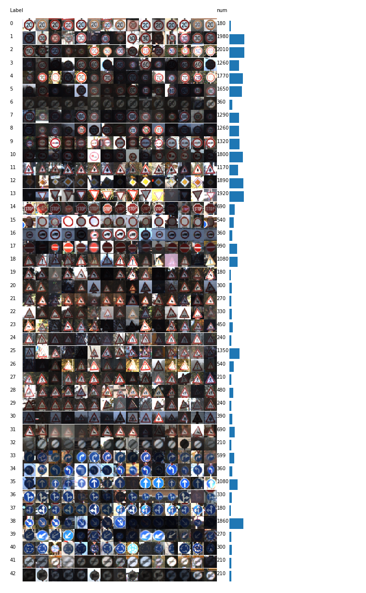
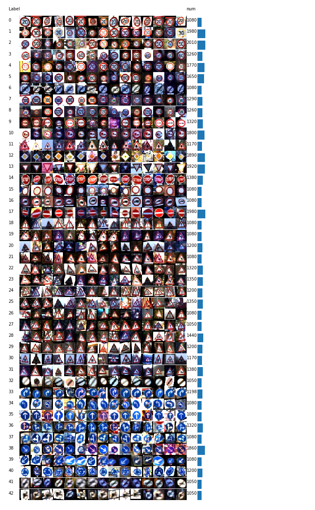
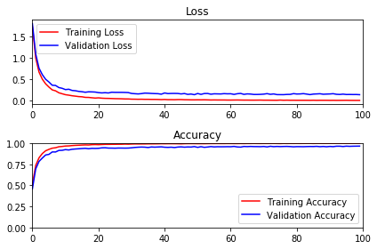
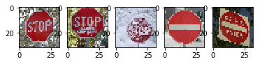

## Project: **Traffic Sign Recognition**

#### The goals / steps of this project are the following:

・Load the data set (see below for links to the project data set)  
・Explore, summarize and visualize the data set  
・Design, train and test a model architecture  
・Use the model to make predictions on new images  
・Analyze the softmax probabilities of the new images  
・Summarize the results with a written report  


---

### Rubric Points
Here I will consider the rubric points individually and describe how I addressed each point in my implementation.  

#### Dataset Exploration
##### 1. Dataset Summary: The submission includes a basic summary of the data set.   

The code for this step is contained in the second code cell of the IPython notebook.

I used the numpy library to calculate summary statistics of the traffic signs data set:

    The size of training set is 34799
    The size of test set is 12630
    The shape of a traffic sign image is (32 x 32 x 3)
    The number of unique classes/labels in the data set is 43

##### 2. Exploratory Visualization: The submission includes an exploratory visualization on the dataset.  

The code for this step is contained in the third code cell of the IPython notebook.

Here is an exploratory visualization of the data set. Each rows represent each class. Each class contains 15 random images. Right numbers and bar charts show the number of images of each class.  




#### Design and Test a Model Architecture
##### 1. Preprocessing: The submission describes the preprocessing techniques used and why these techniques were chosen.  

The code for this step is contained in the fifth code cell of the IPython notebook.

In preprocessing process, I normalized the image data because image contrast is varied by lighting conditions.

To avoid the effects of background brightness, I focused on the central region of images.

In addition, to avoid the effects of highlights,  I sorted the pixel values and I set the top 10% value as max value.  

Here is an example of a traffic sign image after preprocessing. Image contrast fluctuation is improved.



##### 2. Model Architecture: The submission provides details of the characteristics and qualities of the architecture, including the type of model used, the number of layers, and the size of each layer. Visualizations emphasizing particular qualities of the architecture are encouraged.

The code for my final model is located in the 12th cell of the ipython notebook.

My final model consisted of the following layers:

Layer	Description   
Input	32x32x3 RGB image   
Convolution 3x3	1x1 stride, valid padding, outputs 30x30x6   
Max pooling	2x2 stride, outputs 15x15x6   
RELU	 
Convolution 5x5	1x1 stride, valid padding, outputs 11x11x16   
Max pooling	2x2 stride, outputs 5x5x16   
RELU
Flatten, outputs 400   
Fully connected, outputs 120   
RELU   
Dropout   
Fully connected, outputs 84   
RELU   
Dropout   
Fully connected, outputs 43   
RELU   
Dropout   
Softmax   

##### 3. Model Training: The submission describes how the model was trained by discussing what optimizer was used, batch size, number of epochs and values for hyperparameters.

The code for training the model is located in the 14th cell of the ipython notebook.

To train the model, I used the following parameters:  
Optimizer: an Adam optimizer  
Batch size: 200  
Epochs: 100  
Learning rate: 0.0008  

##### 4. Solution Approach: The submission describes the approach to finding a solution. Accuracy on the validation set is 0.93 or greater.

The code for calculating the accuracy of the model is located in the 15th cell of the Ipython notebook.

*My final model results were: *  
training set accuracy of 0.998   
validation set accuracy of 0.965   
test set accuracy of 0.946   

What was the first architecture that was tried and why was it chosen?
I tried LeNet used at the end of the CNN lesson, and convert images to grayscale as preprocessing.

What were some problems with the initial architecture?  
a. Misjudgements on similar structures but different colors, e. g.  Keep left and Stop  
b. Misjudgements on detailed structures, e. g.  Bicycles crossing and Beware of ice/snow  
c. Overfitting: Training set accuracy was high, but validation set accuracy was low.  

How was the architecture adjusted and why was it adjusted?   
a. I used RGB color, not grayscale.   
b. I changed the filter size of first layer to smaller one.   
c. I used dropout and augmented images.  Augmentaion is located in the 9th cell of the notebook. I balanced the number of images per classes.  

Which parameters were tuned? How were they adjusted and why?
I tuned learning rate and set number of epochs at sufficiently large value.   
Training converged more slowly at the smaller learning rate, but the better accuracy could be achieved. However, too small learning rate deteriorate in accuracy. I tried some values and 0.0008 was the best value.

#### Test a Model on New Images
##### 1. Acquiring New Images: The submission includes five new German Traffic signs found on the web, and the images are visualized. Discussion is made as to particular qualities of the images or traffic signs in the images that are of interest, such as whether they would be difficult for the model to classify.

Here are five German traffic signs that I found on the web:   
   
The first image might be easy to classify because it's a normal stop sign.  
The secound image might be difficult to classify because of graffiti.  
The third image might be very difficult to classify because snow covers the most part of sign but human can classify.  
The fourth image might be easy to classify because it's normal no entry sign.  
The fifth image might be difficult to classify because some letters are written on the sign.   

##### 2. Performance on New Images: The submission documents the performance of the model when tested on the captured images. The performance on the new images is compared to the accuracy results of the test set.

The code for making predictions on my final model is located in the 19th cell of the Ipython notebook.

Here are the results of the prediction:

|Image	|Prediction|
|-------|----------|
|Stop Sign|	Stop sign|   
|Stop Sign|	Stop Sign|   
|Stop Sign|	Children crossing|   
|NO Entry|	NO Entry|  
|NO Entry|	NO Entry|   
The model was able to correctly classify the all images except the third one, which gives an accuracy of 80%.    
The third one is cover with snow and training set don't contain such images.   
If this model were used in snow countries, the images with snow have to be contained in training set.    
To make the model more robust, I have to preprocess the images more complicately to reduce the effect of obstacles like snow.    

##### 3. Model Certainty - Softmax Probabilities: The top five softmax probabilities of the predictions on the captured images are outputted. The submission discusses how certain or uncertain the model is of its predictions.

The code for making predictions on my final model is located in the 21th cell of the Ipython notebook.

For the first image, the model is relatively sure that this is a stop sign (probability of 1.0), and the image does contain a stop sign. The top five soft max probabilities were

Probability	Prediction  
.14	Stop  
.01	Speed limit (30km/h)  
.00	Speed limit (20km/h)  
.38	Keep right  
.29	Bicycles crossing  

For the second image, the model is relatively sure that this is a stop sign (probability of 0.99), and the image does contain a stop sign. The top five soft max probabilities were

Probability	Prediction  
.14	Stop  
.29	Bicycles crossing  
.38	Keep right  
.25	Road work  
.22	Bumpy Road  

For the third image, the model is not sure that this is a children crossing (probability of 0.31). The top five soft max probabilities were

Probability	Prediction  
.28	Children crossing  
.01	Speed limit (30km/h)  
.03	Speed limit (60km/h)  
.00	Speed limit (20km/h)  
.06	End of speed limit (80km/h)  

For the fourth image, the model is relatively sure that this is a no entry (probability of 1.0), and the image does contain a no entry sign. The top five soft max probabilities were

Probability	Prediction  
.17	No entry  
.14	Stop  
.09	No passing  
.16	Vehicles over 3.5 metric tons prohibited  
.12	Priority road    

For the fifth image, the model is relatively sure that this is a no entry (probability of 1.0), and the image does contain a no entry sign. The top five soft max probabilities were

Probability	Prediction  
.17	No entry  
.14	Stop  
.09	No passing  
.16	Vehicles over 3.5 metric tons prohibited  
.41	End of no passing  


```python

```
